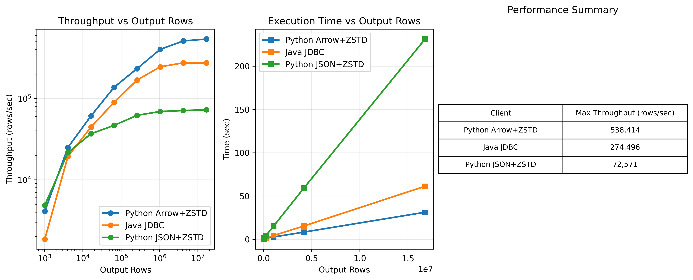
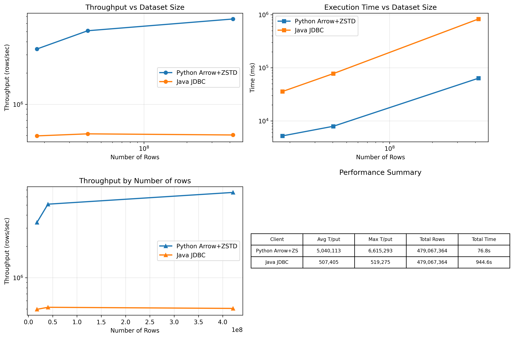

[](https://github.com/mvanderlee/aiotrino/actions?query=workflow%3Aci+event%3Apush+branch%3Apy3-async)
[](https://trino.io/slack.html)
[](https://www.starburst.io/info/oreilly-trino-guide/)

# Introduction

This package provides a asyncio client interface to query [Trino](https://trino.io/)
a distributed SQL engine. It supports Python 3.9, 3.10, 3.11, 3.12, 3.13.

**Note**: This fork is designed to prototype Arrow spooling functionality in conjunction with the Trino server fork at [https://github.com/jonasbrami/trino](https://github.com/jonasbrami/trino), which implements server-side Arrow spooling support.

# Installation

```
$ pip install aiotrino
```

# Quick Start

Use the DBAPI interface to query Trino:

```python
import aiotrino
conn = aiotrino.dbapi.connect(
    host='localhost',
    port=8080,
    user='the-user',
    catalog='the-catalog',
    schema='the-schema',
)
cur = await conn.cursor()
await cur.execute('SELECT * FROM system.runtime.nodes')
rows = await cur.fetchall()
await conn.close()
```
Or with context manager 
```python
import aiotrino
async with aiotrino.dbapi.connect(
    host='localhost',
    port=8080,
    user='the-user',
    catalog='the-catalog',
    schema='the-schema',
) as conn:
    cur = await conn.cursor()
    await cur.execute('SELECT * FROM system.runtime.nodes')
    rows = await cur.fetchall()
```

This will query the `system.runtime.nodes` system tables that shows the nodes
in the Trino cluster.

The DBAPI implementation in `aiotrino.dbapi` provides methods to retrieve fewer
rows for example `Cursorfetchone()` or `Cursor.fetchmany()`. By default
`Cursor.fetchmany()` fetches one row. Please set
`trino.dbapi.Cursor.arraysize` accordingly.

For backwards compatibility with PrestoSQL, override the headers at the start of your application
```python
import aiotrino
aiotrino.constants.HEADERS = aiotrino.constants.PrestoHeaders
```

## Arrow Interface for High-Performance Data Fetching

The arrow interface provides efficient columnar data transfer for large datasets. This feature works in conjunction with the Arrow spooling prototype implemented in the [Trino fork](https://github.com/jonasbrami/trino/tree/arrow_spooling).

### Why Arrow?

A common use case of Trino is to retrieve a large chunk of structured data from a Data lake for later processing using local data processing libraries such as DataFrame libraries, data science libraries...
Large query output can be extremely slow to retrieve using Trino's pure python packages (aiotrino, trino-python-client) because of the huge deserialization cost.

We aim to solve this issue by introducing Arrow format to Trino's Spooling protocol multiplying the throughput of deserialization by hundreds!

This is achieved using fully asynchronous and parallel spooling segment retrieval and also leveraging the fact that PyArrow releases the GIL during the deserialization allowing true parallelism without the need for multiprocessing: Only coroutines (for the segment retrieval) and threads (for the arrow deserialization)

### Fetch All Results

```python
import aiotrino
import asyncio

async def fetch_large_query_result():
    query = """
    SELECT * FROM your_catalog.your_schema.your_table 
    LIMIT 1000000
    """
    
    async with aiotrino.dbapi.connect(
        host="your-trino-host",
        port=8080,
        user='your-username',
        encoding='arrow'  # Enable Arrow encoding for better performance
    ) as conn:
        cursor = await conn.cursor()
        async with cursor as cur:
            await cur.execute(query)
            # Fetch all results as Arrow table
            arrow_table = await cur.fetchall_arrow()
            print(f"Fetched {len(arrow_table)} rows")
            return arrow_table

# Run the async function
arrow_table = asyncio.run(fetch_large_query_result())
```

### Fetch Single Result

```python
import aiotrino
import asyncio

async def fetch_single_result():
    query = "SELECT COUNT(*) as total_rows FROM your_catalog.your_schema.your_table"
    
    async with aiotrino.dbapi.connect(
        host="your-trino-host",
        port=8080,
        user='your-username',
        encoding='arrow'
    ) as conn:
        cursor = await conn.cursor()
        async with cursor as cur:
            await cur.execute(query)
            # Fetch single result as Arrow table
            arrow_table = await cur.fetchone_arrow()
            return arrow_table

result = asyncio.run(fetch_single_result())
```

### Features

- **Arrow Encoding**: In-memory columnar data format, support for 'arrow', 'arrow+zstd' encoding
- **Flexible Fetching**: Use `fetchall_arrow()` for large datasets or `fetchone_arrow()` for single results
- **Async**: Asynchronous segment retrieval and parallel deserialization
- **Easy Integration**: Zero copy, (almost) zero deserialization overhead

### Performance Bottlenecks Explained

The main bottleneck in the JSON+ZSTD Trino python deserialization is that Python does not have any parallelism and we are flat at 100% CPU, most of the time spent on type mapping and casting from JSON to Python. 

In the Trino python json encoding flow, there is no asynchronous retrieval of segments but it wouldn't really matter there because CPU is flat at 100%. Adding multiprocessing is tricky because of the extra cost of IPC and the complexity it adds.

The regular JSON+ZSTD format is relatively slow compared to Arrow because Python is very slow at this kind of operation.

### Benchmark 

Arrow encoding demonstrates substantial performance gains for data-intensive queries, particularly beneficial for large result sets.
Performance comparison between JSON+ZSTD and ARROW+ZSTD encoding shows significant improvements in query execution time using `SELECT * FROM tpcds.sf100000.store_sales LIMIT`. 

In these experiments, we measure the time from the start of the execution of the query to the end of the deserialization on the client side. 



The previous results do not show the full extent of the Arrow speedup because the experiment was run against the tpcds.sf100000.store_sales on only 1 small Trino docker container, therefore it is not representative of real workloads. In real world examples the arrow speedup vs Java JDBC can be more than 20 folds depending on the size of the query result and the size of the Trino cluster.

For example, we spun up a Trino cluster with 4 workers each having 6 CPUs and 48GB of RAM on EKS and using S3 for spooling.
In the following examples, we ran queries of the form `select * from some_iceberg_table where some_attribute in range...`
The schema of the Iceberg table is: 7 doubles, 2 varchar, 1 bigint, 1 timestamp

We got these results:



We can see that after switching to Arrow serialization with asynchronous segment retrieval and parallel deserialization, the bottleneck is now on the Trino cluster.

If we scale up our Trino cluster to have 12 workers each having 6 CPUs and 48GB of RAM, this is the result we get:


We can see that in the case of the JDBC connector, the throughput is bottleneck by client CPU at 500K Rows/sec, however
the Aiotrino with PyArrow example keeps scaling up with the size of the data and the size of the cluster showing a 20x speedup compared to JDBC

In short, this new Aiotrino with Arrow support can give up to 20 folds speedup vs Java/JDBC and over 100 folds speed up version the current pure python based clients. 


# Basic Authentication
The `BasicAuthentication` class can be used to connect to a LDAP-configured Trino
cluster:
```python
import aiotrino
conn = aiotrino.dbapi.connect(
    host='coordinator url',
    port=8443,
    user='the-user',
    catalog='the-catalog',
    schema='the-schema',
    http_scheme='https',
    auth=aiotrino.auth.BasicAuthentication("principal id", "password"),
)
cur = await conn.cursor()
await cur.execute('SELECT * FROM system.runtime.nodes')
rows = await cur.fetchall()
await conn.close()
```

# JWT Token Authentication
The `JWTAuthentication` class can be used to connect to a configured Trino cluster:
```python
import aiotrino
conn = aiotrino.dbapi.connect(
    host='coordinator url',
    port=8443,
    catalog='the-catalog',
    schema='the-schema',
    http_scheme='https',
    auth=aiotrino.auth.JWTAuthentication(token="jwt-token"),
)
cur = await conn.cursor()
await cur.execute('SELECT * FROM system.runtime.nodes')
rows = await cur.fetchall()
await conn.close()
```

# Transactions
The client runs by default in *autocommit* mode. To enable transactions, set
*isolation_level* to a value different than `IsolationLevel.AUTOCOMMIT`:

```python
import aiotrino
from aiotrino import transaction
async with aiotrino.dbapi.connect(
    host='localhost',
    port=8080,
    user='the-user',
    catalog='the-catalog',
    schema='the-schema',
    isolation_level=transaction.IsolationLevel.REPEATABLE_READ,
) as conn:
  cur = await conn.cursor()
  await cur.execute('INSERT INTO sometable VALUES (1, 2, 3)')
  await cur.fetchone()
  await cur.execute('INSERT INTO sometable VALUES (4, 5, 6)')
  await cur.fetchone()
```

The transaction is created when the first SQL statement is executed.
`trino.dbapi.Connection.commit()` will be automatically called when the code
exits the *with* context and the queries succeed, otherwise
`trino.dbapi.Connection.rollback()' will be called.

# Development

## Getting Started With Development

Start by forking the repository and then modify the code in your fork.

Clone the repository and go inside the code directory. Then you can get the
version with `./setup.py --version`.

We recommend that you use `virtualenv` for development:

```
$ virtualenv .venv
$ . .venv/bin/activate
# TODO add requirements.txt: pip install -r requirements.txt
$ pip install .
```

For development purpose, pip can reference the code you are modifying in a
*virtualenv*:

```
$ pip install -e .[tests]
```

That way, you do not need to run `pip install` again to make your changes
applied to the *virtualenv*.

When the code is ready, submit a Pull Request.

## Code Style

- For Python code, adhere to PEP 8.
- Prefer code that is readable over one that is "clever".
- When writing a Git commit message, follow these [guidelines](https://chris.beams.io/posts/git-commit/).

## Running Tests

There is a helper scripts, `run`, that provides commands to run tests.
Type `./run tests` to run both unit and integration tests.

`aiotrino` uses [pytest](https://pytest.org/) for its tests. To run
only unit tests, type:

```
$ pytest tests
```

Then you can pass options like `--pdb` or anything supported by `pytest --help`.

To run the tests with different versions of Python in managed *virtualenvs*,
use `tox` (see the configuration in `tox.ini`):

```
$ tox
```

To run integration tests:

```
$ pytest integration_tests
```

They pull a Docker image and then run a container with a Trino server:
- the image is named `trinodb/trino:${TRINO_VERSION}`
- the container is named `aiotrino-python-client-tests-{uuid4()[:7]}`


### Test setup

Supported OS Ubuntu 22.04

1. Install [pyenv](https://github.com/pyenv/pyenv#automatic-installer)

    ```shell
    curl https://pyenv.run | bash
    ```

2. Install required python versions

    ```shell
    # Install the latest of all supported versions
    pyenv install 3.9, 3.10, 3.11, 3.12, 3.13
    ```

3. Set the installed versions as default for the shell. This allows `tox` to find them.

    List installed versions and update the following command as needed.
    ```shell
    pyenv versions
    ```

    ```shell
    pyenv shell 3.13.2 3.12.9 3.11.11 3.10.16 3.9.21
    ```

4. Install `tox`

    ```shell
    pip install tox
    ```

5. Run `tox`

    ```shell
    tox
    ```

## Releasing

- [Set up your development environment](#Getting-Started-With-Development).
- Change version in `aiotrino/__init__.py`.
- Commit and create an annotated tag (`git tag -m '' current_version`)
- Run the following:
  ```bash
  . .venv/bin/activate &&
  pip install twine wheel &&
  rm -rf dist/ &&
  ./setup.py sdist bdist_wheel &&
  twine upload dist/* &&
  open https://pypi.org/project/aiotrino/ &&
  echo "Released!"
  ```
- Push the branch and the tag (`git push upstream master current_version`)
- Send release announcement.

# Need Help?

Feel free to create an issue as it make your request visible to other users and contributors.

If an interactive discussion would be better or if you just want to hangout and chat about
the Trino Python client, you can join us on the *#python-client* channel on
[Trino Slack](https://trino.io/slack.html).
