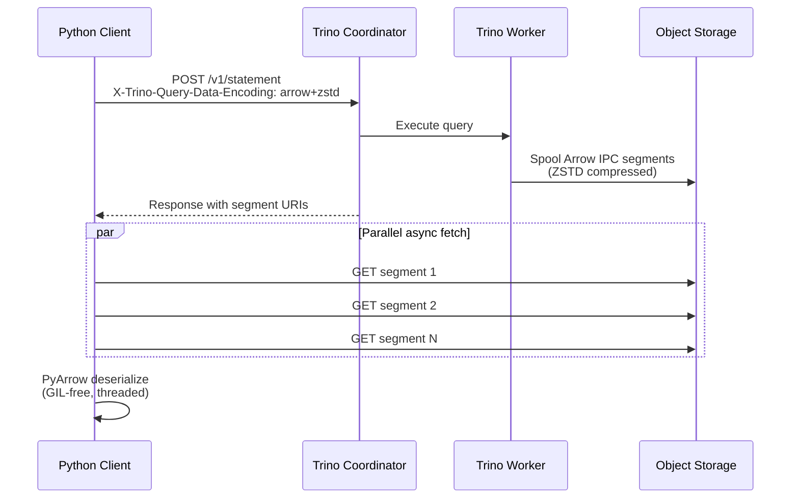

# Arrow Format Support for Trino's Spooling Protocol: 50x Faster Data Retrieval

> **TL;DR** -- I added Apache Arrow IPC as a native encoding to Trino's spooling protocol. Combined with an async Python client (`aiotrino`), this yields up to **50x faster** data retrieval compared to the standard JDBC connector, and **400x faster** than the existing Python JSON flow -- all without any changes to SQL queries.

---

## How It Started

I needed to retrieve large query results from an Iceberg table for downstream processing in Python -- feeding DataFrames, running feature engineering, the usual data pipeline work. I ran my query, opened `top`, and watched a single Python core pinned at 100%. The network was barely used. The Trino cluster was idle. All the time was spent in the Python client's type mapper -- after `json.loads()` parses the response into Python dicts, a `RowMapper` walks every cell and calls `Decimal()`, `date.fromisoformat()`, timezone resolution, string slicing for fractional seconds -- all pure Python, all under the GIL, one cell at a time.

Scaling the Trino cluster couldn't help -- the bottleneck was entirely client-side. More workers, more memory, faster storage -- none of it mattered when a single Python process was the ceiling. On a 4-node cluster, the standard Python client (`trino-python-client`) topped out at ~70K rows/sec. The Java JDBC driver did better (~700K rows/sec) but still hit a client-side CPU wall.

Then I found [PR #25015](https://github.com/trinodb/trino/pull/25015) by [Mateusz Gajewski](https://github.com/wendigo) ([@wendigo](https://github.com/wendigo)) and [Dylan McClelland](https://github.com/dysn) ([@dysn](https://github.com/dysn)). They had the same idea: use Apache Arrow as the wire format for Trino's spooling protocol instead of JSON. They built a working prototype, but the PR was closed and the branch deleted. The idea was too good to let go. I recreated the implementation on current Trino master, added broad type support, and built a Python client ([aiotrino](https://github.com/jonasbrami/aiotrino)) to take full advantage of it. Memory controls for the Arrow buffers were suggested by @wendigo.

## The Problem

The typical Python flow for fetching Trino results looks like this:

```
Trino Worker  -->  JSON serialize  -->  HTTP  -->  Python deserialize  -->  rows
```

This works fine for small result sets. But for millions of rows, it becomes painfully slow. The bottleneck is **Python-side deserialization**: parsing JSON text, then type-mapping every value one row at a time. Python's GIL means this is single-threaded with no parallelism possible -- the CPU pegs at 100% while the network sits idle.

The frustrating part: I had a fast cluster and a fat pipe, but the client was the ceiling. And it's not just Python -- even the Java JDBC driver, which is significantly faster at deserialization, eventually hits the same wall at larger scales.

## Why Arrow?

The fix is to stop serializing to JSON in the first place.

[Apache Arrow IPC](https://arrow.apache.org/) is the standard columnar serialization format. Instead of converting typed columnar data into JSON text (formatting decimals, escaping strings, quoting dates) and then parsing it all back on the client, the server writes its in-memory columnar buffers directly to the wire. The client maps the received bytes into an Arrow table -- no parsing, no type conversion.

A common question: **is Arrow+ZSTD smaller on the wire than JSON+ZSTD?** Not necessarily -- and that's not the point. The win is in the **serialization and deserialization cost**:

- **Server side**: JSON construction is expensive. Every value must be formatted as text, escaped, and quoted. With Arrow, the server writes columnar buffers as-is -- significantly less CPU.
- **Client side**: JSON parsing is the killer. Python must parse every value back from text and type-map it. With Arrow, PyArrow (implemented in C++) maps the bytes directly into a table. Near-zero CPU.

And because the result is already an Arrow table, it's **zero-copy compatible** with Pandas, Polars, DuckDB, and most of the Python data ecosystem. There's no conversion step -- you call `.to_pandas()` or `pl.from_arrow()` and you're done.

On the Python side specifically, PyArrow **releases the GIL** during IPC deserialization. That means `aiotrino` can run deserialization in a thread pool and achieve true parallelism -- something fundamentally impossible with JSON parsing in Python.

**A note on type mapping:** To keep things Arrow-native and minimize deserialization cost, the implementation favors Arrow's type model. Most Trino types map cleanly, but there are caveats where the two models diverge. The main one is timestamps with time zones: Trino supports per-row time zones, while Arrow only supports a single time zone per column. For simplicity and compatibility with DataFrame libraries (which also use column-level time zones), all timestamps are currently converted to UTC. This is a deliberate trade-off -- it keeps the fast path fast and matches what Pandas and Polars expect.

The Arrow+ZSTD encoding was originally proposed by @wendigo in [PR #25015](https://github.com/trinodb/trino/pull/25015). I rebuilt it on the current Trino spooling protocol and implemented the client-side support in `aiotrino`.

## How It Works

Trino's [spooling protocol](https://trino.io/docs/current/client/client-protocol.html) offloads query results to object storage (S3, MinIO, GCS) as segments. Instead of the coordinator streaming rows directly to the client, it returns URIs pointing to the spooled segments. The client fetches them independently.



In `aiotrino`, the `fetchall_arrow()` method implements a fully pipelined retrieval loop. It keeps awaiting the next segment URI from the Trino coordinator, and as soon as one arrives, it immediately fires off a concurrent task for that segment -- no waiting for the previous one to finish. Each task downloads the segment data (async HTTP, bounded by a semaphore to limit concurrency) and then hands the raw bytes to a thread pool of Arrow workers for deserialization. Because PyArrow releases the GIL, these threads achieve true parallelism.

The result is a three-stage pipeline where coordinator polling, HTTP downloads, and Arrow deserialization all overlap:

```mermaid
gantt
    title fetchall_arrow() — Pipelined Segment Retrieval
    todayMarker off
    dateFormat x
    axisFormat  
    section Segment 1
        await URI            :a1, 0, 100
        download (async)     :d1, 100, 400
        deserialize (thread) :r1, 400, 550
    section Segment 2
        await URI            :a2, 100, 200
        download (async)     :d2, 200, 500
        deserialize (thread) :r2, 500, 650
    section Segment 3
        await URI            :a3, 200, 300
        download (async)     :d3, 300, 600
        deserialize (thread) :r3, 600, 750
    section Result
        concat_tables()      :c1, 750, 850
```



Each row is a segment. The staggered bars show that while segment 1 is downloading, segment 2's URI is already being polled. While segment 1 is deserializing, segments 2 and 3 are downloading. Nothing blocks — the entire pipeline runs concurrently.

The key insight: after switching to Arrow, the bottleneck shifts from **client CPU** to **network and Trino cluster performance** -- which is exactly where it should be. The client is no longer the limiting factor.

## The Code

From the client's perspective, the change is minimal. Set the encoding to `arrow+zstd` and use the segment cursor:

```python
import aiotrino

conn = aiotrino.dbapi.Connection(
    host="localhost",
    port=8085,
    user="demo",
    encoding="arrow+zstd",  # <-- this is the only change
)

async with await conn.cursor(cursor_style="segment") as cur:
    await cur.execute("SELECT * FROM iceberg.my_schema.my_table")
    arrow_table = await cur.fetchall_arrow()

# Zero-copy to Pandas or Polars
df = arrow_table.to_pandas()
```

That's it. `fetchall_arrow()` handles the parallel segment fetching, threaded deserialization, and concatenation internally. The result is a `pyarrow.Table` ready for whatever comes next.

## The Proof

I benchmarked three client transports fetching `SELECT * FROM lineitem`: Java JDBC (the standard Trino client), Python JSON+ZSTD (the legacy `aiotrino` path), and Python Arrow+ZSTD (the new path). All benchmarks measure **wall-clock time** and **total CPU time** (user + system, across all threads and child processes).

Let's start small and scale up.

### Local Docker -- 6M rows (TPC-H SF1)

| Encoding | Rows | Time (s) | CPU (s) | CPU Eff | Rows/sec |
|---|---:|---:|---:|---:|---:|
| JDBC | 6,001,215 | 15.3 | 34.3 | 2.24x | 392,236 |
| JSON+ZSTD | 6,001,215 | 72.6 | 66.4 | 0.91x | 82,687 |
| **Arrow+ZSTD** | **6,001,215** | **4.0** | **4.5** | **1.14x** | **1,516,506** |

Even on a single local container, Arrow is **18x faster** than JSON and **4x faster** than JDBC.

### Local Docker -- 60M rows (Iceberg/Parquet on MinIO)

| Encoding | Rows | Time (s) | CPU (s) | CPU Eff | Rows/sec |
|---|---:|---:|---:|---:|---:|
| JDBC | 59,986,052 | 146.4 | 281.0 | 1.92x | 409,741 |
| JSON+ZSTD | 59,986,052 | 714.4 | 648.7 | 0.91x | 83,969 |
| **Arrow+ZSTD** | **59,986,052** | **23.1** | **43.2** | **1.87x** | **2,601,728** |

Arrow+ZSTD is **31x faster** than JSON+ZSTD and **6.3x faster** than JDBC.

**Understanding CPU Efficiency** (CPU time / wall time = average cores busy):

- **JSON+ZSTD (0.91x)** -- single-threaded, CPU-bound. Python's GIL prevents any parallelism. The value below 1.0 reflects occasional I/O wait.
- **Arrow+ZSTD (1.87x)** -- ~2 cores busy on average. PyArrow releases the GIL, so the thread pool achieves real parallelism. It crammed 43s of CPU work into 23s of wall time.
- **JDBC (1.92x)** -- ~2 cores busy from JVM internal threads (GC, Netty, JIT). Despite similar CPU efficiency to Arrow, JDBC uses **6.5x more total CPU** (281s vs 43s) to transfer the same data.

**Arrow+ZSTD achieves the best wall-clock time while using the least total CPU.** It's both faster and more efficient.

The CPU (s) column tells a deeper story. JSON+ZSTD burns 648.7 seconds of total CPU to transfer 60M rows. Arrow+ZSTD uses 43.2 seconds -- **15x less**. This means that even if you could somehow parallelize JSON type mapping through multiprocessing (paying the massive pickling overhead to shuttle data between processes), you'd still consume 15x more total CPU than Arrow. The problem isn't just that JSON deserialization is single-threaded under the GIL -- it's that the work itself is fundamentally expensive. Arrow eliminates the work entirely.

### Single Node Cluster -- up to 16M rows (TPC-DS SF100K)

Query: `SELECT * FROM tpcds.sf100000.store_sales LIMIT N`

| Rows | JSON+ZSTD (ms) | Arrow+ZSTD (ms) | Speedup |
|---:|---:|---:|---:|
| 16,384 | 445 | 269 | 1.7x |
| 65,536 | 1,406 | 477 | 2.9x |
| 262,144 | 4,227 | 1,124 | 3.8x |
| 1,048,576 | 15,172 | 2,606 | 5.8x |
| 4,194,304 | 59,103 | 8,223 | 7.2x |
| 16,777,216 | 231,183 | 31,160 | **7.4x** |

Already **7x faster** at 16M rows, but this single-node setup is bottlenecked by Trino's scan speed. The real gains come when the cluster can scan faster than the client can deserialize.

### Large Cluster -- up to 637M rows (4 workers, 16 CPU / 128 GB each)

Query: `SELECT * FROM iceberg_table WHERE ...` (schema: 7 doubles, 2 varchar, 1 bigint, 1 timestamp)


| Rows | JDBC (ms) | JSON+ZSTD (ms) | Arrow+ZSTD (ms) | Arrow vs JDBC | Arrow vs JSON |
|---:|---:|---:|---:|---:|---:|
| ~2M | 6,690 | 23,934 | 3,699 | **1.8x** | **6.5x** |
| ~4M | 9,411 | 46,408 | 4,995 | **1.9x** | **9.3x** |
| ~8M | 16,107 | 96,148 | 7,371 | **2.2x** | **13x** |
| ~18M | 29,524 | 211,082 | 9,046 | **3.3x** | **23x** |
| ~55M | 80,834 | -- | 9,237 | **8.8x** | -- |
| ~111M | 159,560 | -- | 9,352 | **17x** | -- |
| ~245M | -- | -- | 12,128 | **50x+** | **400x+** |
| ~637M | -- | -- | 18,437 | -- | -- |

At 245M rows, `aiotrino` with Arrow+ZSTD retrieves data at **~20M rows/sec**. JDBC and JSON have long since hit their CPU ceiling. The dashes in the table aren't missing data -- those clients simply couldn't finish in a reasonable time.

This is the whole point: with Arrow, the client gets out of the way. The bottleneck moves to the cluster and the network, where you can actually throw hardware at it.

## Try It Yourself

I packaged everything into a single Docker Compose setup. One command reproduces all the local benchmarks above:

```bash
git clone https://github.com/jonasbrami/trino-arrow-demo
cd trino-arrow-demo
./scripts/setup.sh && docker compose up
```

The repo includes three Python examples and a Java JDBC benchmark for comparison. No host-side Python or Java install needed -- everything runs in containers.

<details>
<summary><b>Detailed Docker setup instructions</b></summary>

### Prerequisites

- Docker and Docker Compose

### Build and run

```bash
./scripts/setup.sh       # downloads SQLite JDBC driver for the Iceberg catalog
docker compose build      # builds the client image (Python + Java + aiotrino)
docker compose up         # runs everything end-to-end
```

This starts the full pipeline automatically:

1. **MinIO** -- S3-compatible object storage (console at [http://localhost:9001](http://localhost:9001), login: `admin` / `minio123`)
2. **Trino** -- Custom build with Arrow spooling enabled, TPC-H connector, and Iceberg catalog
3. **generate-data** -- Materializes ~86M rows of TPC-H SF10 into Iceberg/Parquet on MinIO
4. **client** -- Runs the full JDBC vs JSON+ZSTD vs Arrow+ZSTD benchmark on both data sources

### Data sources

The benchmarks run against two TPC-H data sources:

| Source | Catalog | Data | Notes |
|--------|---------|------|-------|
| **tpch** | `tpch.sf1` | ~6M lineitem rows, generated on-the-fly | No setup needed |
| **iceberg** | `iceberg.tpch_sf10` | ~60M lineitem rows, Parquet on MinIO | Created by `generate-data` service |

### Interactive mode

```bash
docker compose up -d trino
docker compose run --rm client sleep infinity &
docker compose exec client bash

# Inside the container:
python /app/examples/01_basic_arrow_fetch.py
python /app/examples/01_basic_arrow_fetch.py --source iceberg
python /app/examples/02_streaming_arrow.py
python /app/examples/03_benchmark_json_vs_arrow.py --source iceberg

# Java JDBC benchmark directly
java -cp /app/java:/app/lib/trino-jdbc.jar JdbcBenchmark tpch
java -cp /app/java:/app/lib/trino-jdbc.jar JdbcBenchmark iceberg
```

### Server-side configuration

To enable Arrow spooling on your own Trino server, add to `config.properties`:

```properties
protocol.spooling.enabled=true
protocol.spooling.shared-secret-key=<base64-encoded-key>
protocol.spooling.encoding.arrow.enabled=true
protocol.spooling.encoding.arrow+zstd.enabled=true
```

And the required JVM flags in `jvm.config`:

```
--enable-native-access=ALL-UNNAMED
--add-opens=java.base/java.nio=org.apache.arrow.memory.core,ALL-UNNAMED
```

See the `etc/` directory for a complete working configuration with MinIO.

### Clean up

```bash
docker compose down -v
```

</details>

## What's Next

- Upstream the Arrow spooling implementation into Trino mainline
- Add Arrow support to the official `trino-python-client`
- Explore Arrow Flight as an alternative transport for even lower latency

The Python data ecosystem already runs on Arrow. Trino's spooling protocol already supports pluggable encodings. Connecting the two was a natural fit. I hope this implementation and the benchmarks make the case for bringing Arrow support into Trino mainline.

## Acknowledgments

This project would not exist without the foundational work of [Mateusz Gajewski](https://github.com/wendigo) ([@wendigo](https://github.com/wendigo)) and [Dylan McClelland](https://github.com/dysn) ([@dysn](https://github.com/dysn)). They designed and prototyped the Arrow IPC encoding for Trino's spooling protocol in [PR #25015](https://github.com/trinodb/trino/pull/25015). Their work laid the groundwork for everything described here. I hope this continuation does it justice.

## Links

- **Trino PR**: [trinodb/trino#26365](https://github.com/trinodb/trino/pull/26365) -- Server-side Arrow spooling
- **aiotrino PR**: [jonasbrami/aiotrino#7](https://github.com/jonasbrami/aiotrino/pull/7) -- Python client Arrow support
- **Trino Fork**: [github.com/jonasbrami/trino/tree/arrow_spooling](https://github.com/jonasbrami/trino/tree/arrow_spooling)
- **aiotrino Fork**: [github.com/jonasbrami/aiotrino/tree/main](https://github.com/jonasbrami/aiotrino/tree/main)
- **Apache Arrow**: [arrow.apache.org](https://arrow.apache.org/)
- **Trino Spooling Protocol**: [trino.io/docs](https://trino.io/docs/current/client/client-protocol.html)
