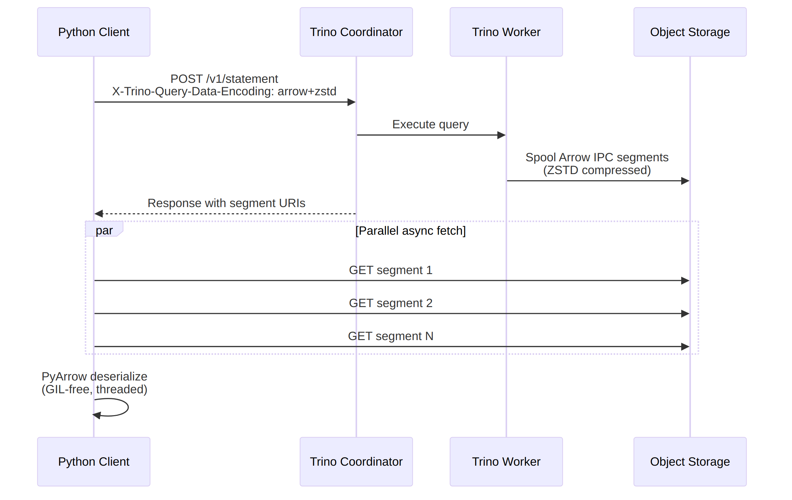
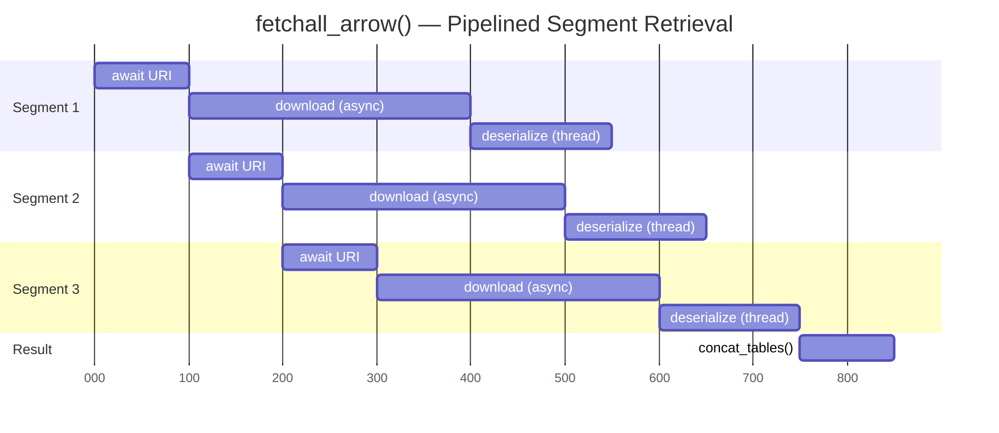
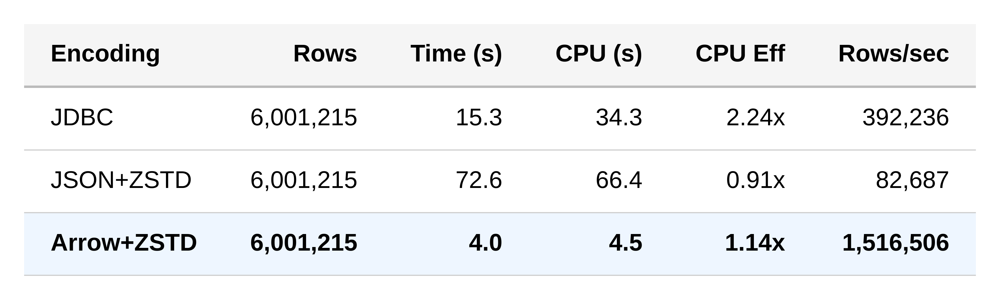
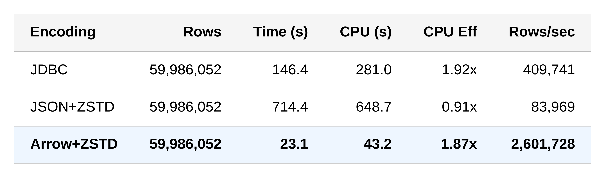
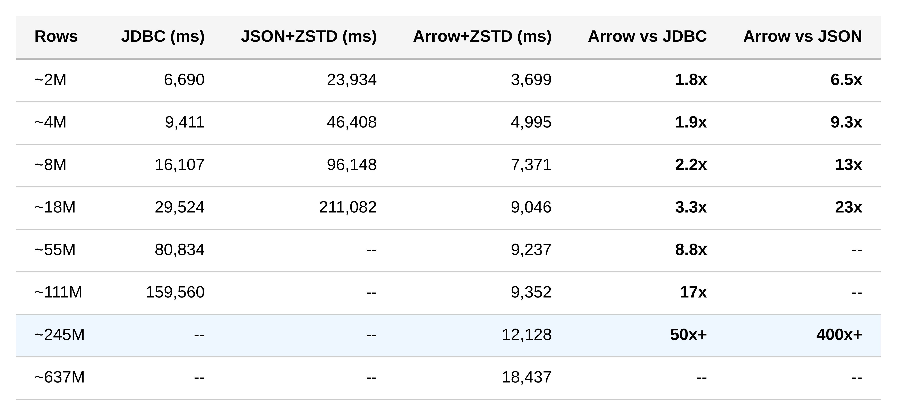
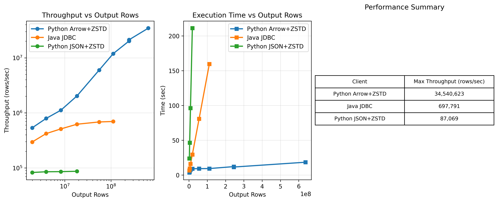

# How We Made Consuming Trino Results from Python 400× Faster with Apache Arrow

> **TL;DR** — By adding Apache Arrow IPC as a native encoding to Trino's spooling protocol and pairing it with an async Python client (`aiotrino`), large Iceberg query results can be streamed into Python at up to **50× faster** than JDBC and **400× faster** than the standard Python JSON path — without changing a single SQL query.

---

## The Python Core That Wouldn't Move

Trino was fast. Queries over large Iceberg tables — joins, aggregations, filters — executed in seconds across the cluster. The engine did its job. But the moment the result set was large and needed to come back into Python, everything stalled.

I opened `top` and watched a single Python core pinned at 100%. The network was barely used. The Trino workers were idle, waiting for the client to catch up.

Scaling the cluster didn't help. Adding workers didn't help. Faster disks didn't help.

The bottleneck wasn't in query execution. It was in the last mile: downloading results back into Python.

On a 4-node cluster, the standard Python client (`trino-python-client`) topped out at tens of thousands of rows per second — the exact number depends on column count and types, but the pattern was always the same. The Java JDBC driver did better but still hit a client-side CPU wall at scale.

---

## The Hidden Cost of Fetching Rows

The typical Python path for retrieving results from Trino looks like this:

```
Trino Worker  →  JSON serialize  →  HTTP  →  json.loads()  →  type mapping  →  rows
```

That last step is where performance collapses at scale.

After `json.loads()` parses the response into Python dicts, a `RowMapper` walks every cell:

* `Decimal()` for precise numerics
* `date.fromisoformat()` for dates
* timezone resolution for timestamps
* string slicing for fractional seconds

All pure Python. All under the GIL. One cell at a time.

For small result sets, this overhead is negligible. For millions of rows, it dominates.

---

## A Columnar Engine Speaking JSON

Trino is columnar. Iceberg is columnar. Parquet is columnar. Pandas and Polars are columnar.

Yet in the middle of this columnar pipeline, results were flattened into row-oriented JSON text — only to be parsed back into typed columns on the client.

Every value formatted as text. Every value parsed back from text. Every value converted into a Python object.

The system wasn't bottlenecked on I/O. It was bottlenecked on string manipulation.

JSON was the only row-oriented hop in the pipeline. Removing it restores columnar end-to-end flow.

---

## The Idea That Almost Landed

This problem wasn't new.

In [PR #25015](https://github.com/trinodb/trino/pull/25015), [Mateusz Gajewski](https://github.com/wendigo) ([@wendigo](https://github.com/wendigo)) and [Dylan McClelland](https://github.com/dysn) ([@dysn](https://github.com/dysn)) proposed adding Apache Arrow IPC as a wire encoding for Trino's spooling protocol. They built a working prototype, but the PR was closed and the branch deleted.

The idea was too good to let go. I recreated the implementation on current Trino master, added broad type support, and built a Python client ([aiotrino](https://github.com/jonasbrami/aiotrino)) to take full advantage of it. Memory controls for the Arrow buffers were suggested by @wendigo.

---

## What Changes When You Stop Parsing Text

[Apache Arrow IPC](https://arrow.apache.org/) doesn't serialize values into strings. It writes columnar buffers directly to the wire.

Instead of formatting decimals, escaping strings, and quoting dates — the server writes its in-memory columnar data structures as-is. On the client side, PyArrow (implemented in C++) maps the received bytes directly into an Arrow table. No parsing. No per-cell type conversion. No Python object construction.

A common question: **is Arrow+ZSTD smaller on the wire than JSON+ZSTD?** Not necessarily — and that's not the point. The win is in the **serialization and deserialization cost**:

- **Server side**: JSON construction is expensive — every value must be formatted as text, escaped, and quoted. With Arrow, the server writes columnar buffers as-is.
- **Client side**: JSON parsing is the killer. Python must parse every value back from text and type-map it. With Arrow, PyArrow maps the bytes directly into a table. Near-zero CPU.

And because the result is already an Arrow table, it's **zero-copy compatible** with Pandas, Polars, DuckDB, and the rest of the Python data ecosystem. No conversion step — call `.to_pandas()` or `pl.from_arrow()` and you're done.

Critically, PyArrow **releases the GIL** during IPC deserialization. That means `aiotrino` can run deserialization in a thread pool with real parallelism — something fundamentally impossible with JSON parsing in Python.

**A note on type mapping:** Most Trino types map cleanly to Arrow, but there are caveats. The main one is timestamps with time zones: Trino supports per-row time zones, while Arrow only supports a single time zone per column. For simplicity and compatibility with DataFrame libraries (which also use column-level time zones), all timestamps are currently converted to UTC. This is a deliberate trade-off — it keeps the fast path fast and matches what Pandas and Polars expect.

---

## How It Works

Trino's [spooling protocol](https://trino.io/docs/current/client/client-protocol.html) offloads query results to object storage (S3, MinIO, GCS) as segments. Instead of the coordinator streaming rows directly to the client, it returns URIs pointing to the spooled segments. The client fetches them independently.

This design is key. Workers dump result chunks to object storage as soon as they're ready, regardless of how fast the client is consuming. The client doesn't slow down the cluster, and the cluster doesn't gate the client. A fast object store (MinIO, S3) acts as a buffer between the two, allowing workers to free their resources immediately and move on to the next query. The spooling protocol effectively decouples production from consumption.

With Arrow encoding, this architecture really shines. Each spooled segment is a self-contained Arrow IPC buffer — the client can fetch and deserialize them asynchronously, in parallel, at whatever speed the network allows.



In `aiotrino`, the `fetchall_arrow()` method implements a fully pipelined retrieval loop. It keeps awaiting the next segment URI from the Trino coordinator, and as soon as one arrives, it immediately fires off a concurrent task — no waiting for the previous one to finish. Each task downloads the segment data (async HTTP, bounded by a semaphore to limit concurrency) and then hands the raw bytes to a thread pool of Arrow workers for deserialization. Because PyArrow releases the GIL, these threads achieve true parallelism.

The result is a three-stage pipeline where coordinator polling, HTTP downloads, and Arrow deserialization all overlap:



Each row is a segment. The staggered bars show that while segment 1 is downloading, segment 2's URI is already being polled. While segment 1 is deserializing, segments 2 and 3 are downloading. Nothing blocks — the entire pipeline runs concurrently.

Once Arrow replaced JSON, the bottleneck shifted from client CPU to network throughput and cluster scan speed — exactly where it belongs.

---

## The Code

From the client's perspective, the change is minimal. Set the encoding to `arrow+zstd` and use the segment cursor:

```python
import aiotrino

conn = aiotrino.dbapi.Connection(
    host="localhost",
    port=8085,
    user="demo",
    encoding="arrow+zstd",  # <-- this is the only change
)

async with await conn.cursor(cursor_style="segment") as cur:
    await cur.execute("SELECT * FROM iceberg.my_schema.my_table")
    arrow_table = await cur.fetchall_arrow()

# Zero-copy to Pandas or Polars
df = arrow_table.to_pandas()
```

No SQL changes. No schema changes. Just a different wire encoding.

---

## The Proof

I benchmarked three client transports fetching `SELECT * FROM lineitem`: Java JDBC (the standard Trino client), Python JSON+ZSTD (the legacy `aiotrino` path), and Python Arrow+ZSTD (the new path). All benchmarks measure **wall-clock time** and **total CPU time** (user + system, across all threads and child processes).

### Local Docker — 6M rows (TPC-H SF1)



Even on a single local container, Arrow is **18× faster** than JSON and **4× faster** than JDBC.

### Local Docker — 60M rows (Iceberg/Parquet on MinIO)



Arrow+ZSTD is **31× faster** than JSON+ZSTD and **6.3× faster** than JDBC.

**CPU Efficiency** (CPU time / wall time = average cores busy):

- **JSON+ZSTD (0.91×)** — single-threaded, CPU-bound. Python's GIL prevents any parallelism. The value below 1.0 reflects occasional I/O wait.
- **Arrow+ZSTD (1.87×)** — ~2 cores busy on average. PyArrow releases the GIL, so the thread pool achieves real parallelism. 43s of CPU work crammed into 23s of wall time.
- **JDBC (1.92×)** — ~2 cores busy from JVM internal threads (GC, Netty, JIT). Despite similar CPU efficiency to Arrow, JDBC uses **6.5× more total CPU** (281s vs 43s) to transfer the same data.

**Arrow+ZSTD achieves the best wall-clock time while using the least total CPU.** It's both faster and more efficient.

The CPU column tells a deeper story. JSON+ZSTD burns 649 seconds of total CPU to transfer 60M rows. Arrow+ZSTD uses 43 seconds — **15× less**. Even if you could somehow parallelize JSON type mapping through multiprocessing (paying the massive pickling overhead to shuttle data between processes), you'd still consume 15× more total CPU than Arrow. The problem isn't just that JSON deserialization is single-threaded under the GIL — it's that the work itself is fundamentally expensive. Arrow eliminates the work entirely.

### Large Cluster — up to 637M rows

The local benchmarks above are bottlenecked by a single Docker container's scan speed. To really push the Arrow speedup, we scaled up to a larger setup:

- 4 workers, each with 16 CPUs and 128 GB of RAM
- A well-compacted Iceberg table instead of runtime-generated TPC-DS data
- Schema: 7 doubles, 2 varchar, 1 bigint, 1 timestamp
- MinIO on an i3en node for spooling (instead of AWS S3)

Queries: `SELECT * FROM iceberg_table WHERE some_attribute IN range...`



The speedup grows with scale. At ~18M rows, Arrow is already 3.3× faster than JDBC and 23× faster than JSON. By ~111M rows, JDBC is 17× slower and JSON can no longer finish at all. At ~245M rows, Arrow retrieves the full result in ~12 seconds — **50×+ faster than JDBC** and **400×+ faster than JSON**.

The dashes in the table aren't missing data — those clients simply couldn't complete in a reasonable time.

Peak throughput tells the full story:

| Client | Max Throughput (rows/sec) |
|--------|--------------------------|
| Python Arrow+ZSTD | **34,540,623** |
| Java JDBC | 697,791 |
| Python JSON+ZSTD | 87,069 |



The green (Python JSON) and orange (Java JDBC) lines stop early — they were too slow to justify continuing the experiment at larger sizes. The blue line (Arrow) keeps climbing. The JDBC connector hits a client CPU ceiling at ~700K rows/sec, Python JSON flatlines at ~87K rows/sec. But `aiotrino` with PyArrow keeps scaling with data size and cluster size — peaking at **~34.5M rows/sec**. That's 50× the JDBC ceiling and 400× the Python JSON ceiling.

After switching from JSON to Arrow, the bottleneck becomes how fast Trino can scan the Iceberg table in object storage — exactly where it should be. The client is no longer the limiting factor.

---

## Try It Yourself

I packaged everything into a single Docker Compose setup. One command reproduces all the local benchmarks above:

```bash
git clone https://github.com/jonasbrami/aiotrino
cd aiotrino/arrow_demo
docker compose up
```

The repo includes three Python examples and a Java JDBC benchmark for comparison. No host-side Python or Java install needed — everything runs in containers.

<details>
<summary><b>Detailed Docker setup instructions</b></summary>

### Prerequisites

- Docker and Docker Compose

### Build and run

```bash
docker compose build      # builds all images (Trino + client + init containers)
docker compose up         # runs everything end-to-end
```

This starts the full pipeline automatically:

1. **MinIO** — S3-compatible object storage (console at [http://localhost:9001](http://localhost:9001), login: `admin` / `minio123`)
2. **Trino** — Custom build with Arrow spooling enabled, TPC-H connector, and Iceberg catalog
3. **generate-data** — Materializes ~86M rows of TPC-H SF10 into Iceberg/Parquet on MinIO
4. **client** — Runs the full JDBC vs JSON+ZSTD vs Arrow+ZSTD benchmark on both data sources

### Data sources

The benchmarks run against two TPC-H data sources:

| Source | Catalog | Data | Notes |
|--------|---------|------|-------|
| **tpch** | `tpch.sf1` | ~6M lineitem rows, generated on-the-fly | No setup needed |
| **iceberg** | `iceberg.tpch_sf10` | ~60M lineitem rows, Parquet on MinIO | Created by `generate-data` service |

### Interactive mode

```bash
docker compose up -d trino
docker compose run --rm client sleep infinity &
docker compose exec client bash

# Inside the container:
python /app/examples/01_basic_arrow_fetch.py
python /app/examples/01_basic_arrow_fetch.py --source iceberg
python /app/examples/02_streaming_arrow.py
python /app/examples/03_benchmark_json_vs_arrow.py --source iceberg

# Java JDBC benchmark directly
java -cp /app/java:/app/lib/trino-jdbc.jar JdbcBenchmark tpch
java -cp /app/java:/app/lib/trino-jdbc.jar JdbcBenchmark iceberg
```

### Server-side configuration

To enable Arrow spooling on your own Trino server, add to `config.properties`:

```properties
protocol.spooling.enabled=true
protocol.spooling.shared-secret-key=<base64-encoded-key>
protocol.spooling.encoding.arrow.enabled=true
protocol.spooling.encoding.arrow+zstd.enabled=true
```

And the required JVM flags in `jvm.config`:

```
--enable-native-access=ALL-UNNAMED
--add-opens=java.base/java.nio=org.apache.arrow.memory.core,ALL-UNNAMED
```

See the `etc/` directory for a complete working configuration with MinIO.

### Clean up

```bash
docker compose down -v
```

</details>

---

## Acknowledgments

None of this is built from scratch.

The Arrow IPC encoding for Trino's spooling protocol was designed and prototyped by [Mateusz Gajewski](https://github.com/wendigo) ([@wendigo](https://github.com/wendigo)) and [Dylan McClelland](https://github.com/dysn) ([@dysn](https://github.com/dysn)) in [PR #25015](https://github.com/trinodb/trino/pull/25015). They had the idea, they built the proof of concept, and they proved it could work. The PR was closed, but the design was sound. I picked it up, adapted it to current Trino internals, expanded type coverage, and built the Python client around it — but the core idea and the server-side architecture are theirs.

The spooling protocol itself — the decoupled, segment-based design that makes all of this possible — is the work of the Trino team. The `aiotrino` client is a fork of [mvanderlee/aiotrino](https://github.com/mvanderlee/aiotrino). Memory controls for the Arrow buffers were suggested by @wendigo.

I connected the pieces. The pieces were built by others.

---

## Links

- **Trino PR**: [trinodb/trino#26365](https://github.com/trinodb/trino/pull/26365) — Server-side Arrow spooling
- **aiotrino PR**: [jonasbrami/aiotrino#7](https://github.com/jonasbrami/aiotrino/pull/7) — Python client Arrow support
- **Trino Fork**: [github.com/jonasbrami/trino/tree/arrow_spooling](https://github.com/jonasbrami/trino/tree/arrow_spooling)
- **aiotrino Fork**: [github.com/jonasbrami/aiotrino/tree/main](https://github.com/jonasbrami/aiotrino/tree/main)
- **Apache Arrow**: [arrow.apache.org](https://arrow.apache.org/)
- **Trino Spooling Protocol**: [trino.io/docs](https://trino.io/docs/current/client/client-protocol.html)
